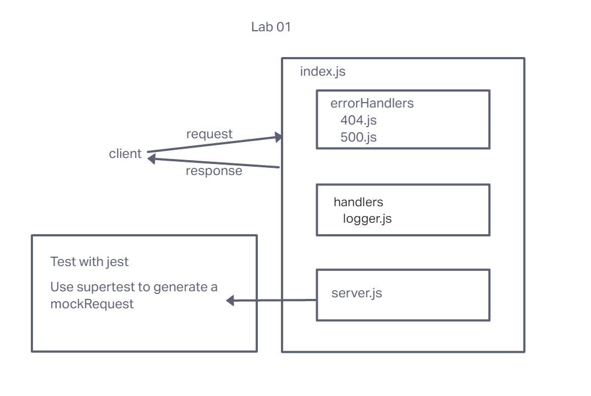

# LAB - Class 01

## Project: Server Deployment Practice

### Author: Melo

### Problem Domain

Basic API server where middleware is written and practice deployment.

### Links and Resources

- [GitHub Actions ci/cd](https://github.com/MelodicXP/server-deployment-practice/actions)
- [back-end server url](http://xyz.com) (when applicable)

### Collaborators

### Setup

#### `.env` requirements (where applicable)

None required for this lab.

#### How to initialize/run your application (where applicable)

- e.g. `npm start`

#### How to use your library (where applicable)

#### Features / Routes

- Feature One: Deploy as dev branch once ci/cd works.

#### Tests

<!-- fill in as see fit -->

- How do you run tests?
- Any tests of note?
- Describe any tests that you did not complete, skipped, etc

#### UML

